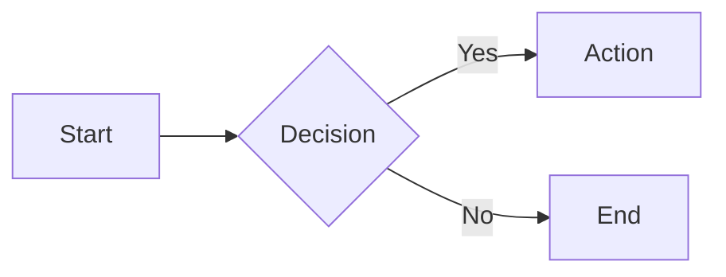

# Features

A detailed reference for every feature supported by **Markdown Viewer**.

---

## Table of Contents

- [Live Split-Screen Preview](#live-split-screen-preview)
- [GitHub-Style Rendering](#github-style-rendering)
- [Syntax Highlighting](#syntax-highlighting)
- [LaTeX Mathematical Equations](#latex-mathematical-equations)
- [Mermaid Diagrams](#mermaid-diagrams)
- [Dark / Light Theme](#dark--light-theme)
- [Export Options](#export-options)
- [File Import](#file-import)
- [Share via URL](#share-via-url)
- [Content Statistics](#content-statistics)
- [Emoji Support](#emoji-support)
- [Copy to Clipboard](#copy-to-clipboard)
- [Synchronized Scrolling](#synchronized-scrolling)
- [Resizable Panes](#resizable-panes)
- [Multiple View Modes](#multiple-view-modes)
- [Responsive Design](#responsive-design)
- [Privacy & Security](#privacy--security)

---

## Live Split-Screen Preview

The editor and preview panes update simultaneously as you type. There is no "refresh" button — rendering happens on every keystroke using a debounced function to keep performance smooth.

- Rendering is powered by **[marked.js](https://marked.js.org/)**.
- The preview is styled with **[github-markdown-css](https://github.com/sindresorhus/github-markdown-css)**, giving output identical to GitHub's rendering engine.

---

## GitHub-Style Rendering

Markdown Viewer implements the **GitHub Flavored Markdown (GFM)** specification:

- Strikethrough (`~~text~~`)
- Tables
- Task lists (`- [x] item`)
- Fenced code blocks with language identifiers
- Autolinks
- Extended autolinks (e.g., bare URLs become clickable links)

---

## Syntax Highlighting

Code blocks are automatically syntax-highlighted for **190+ programming languages** using **[highlight.js](https://highlightjs.org/)**.

To enable highlighting, specify the language after the opening fence:

````markdown
```python
def hello(name: str) -> str:
    return f"Hello, {name}!"
```
````

**Supported languages include** (but are not limited to):

`bash`, `c`, `cpp`, `csharp`, `css`, `dart`, `diff`, `docker`, `go`, `graphql`, `haskell`, `html`, `java`, `javascript`, `json`, `kotlin`, `lua`, `markdown`, `nginx`, `perl`, `php`, `python`, `r`, `ruby`, `rust`, `scala`, `shell`, `sql`, `swift`, `toml`, `typescript`, `xml`, `yaml`, and many more.

---

## LaTeX Mathematical Equations

Mathematical expressions are rendered using **[MathJax](https://www.mathjax.org/)**.

### Inline Math

Wrap inline expressions with single dollar signs:

```markdown
The quadratic formula is $x = \frac{-b \pm \sqrt{b^2 - 4ac}}{2a}$.
```

### Block / Display Math

Wrap block expressions with double dollar signs:

```markdown
$$
\int_0^\infty e^{-x^2} dx = \frac{\sqrt{\pi}}{2}
$$
```

MathJax supports the full LaTeX math-mode command set including matrices, fractions, sums, integrals, Greek letters, and more.

---

## Mermaid Diagrams

Diagrams are rendered using **[Mermaid](https://mermaid.js.org/)** inside fenced code blocks tagged with `mermaid`.

### Supported Diagram Types

| Type | Keyword |
|------|---------|
| Flowchart | `flowchart` / `graph` |
| Sequence Diagram | `sequenceDiagram` |
| Class Diagram | `classDiagram` |
| State Diagram | `stateDiagram-v2` |
| Entity-Relationship | `erDiagram` |
| Gantt Chart | `gantt` |
| Pie Chart | `pie` |
| User Journey | `journey` |
| Git Graph | `gitGraph` |
| Mindmap | `mindmap` |

### Example

````markdown

````

### Diagram Toolbar

Each rendered Mermaid diagram has an interactive toolbar:

| Button | Action |
|--------|--------|
| ➕ Zoom In | Increase diagram size |
| ➖ Zoom Out | Decrease diagram size |
| 🔄 Reset | Reset zoom and pan to default |
| 💾 Save PNG | Download the diagram as a PNG image |

Diagrams also support **pan** by clicking and dragging.

---

## Dark / Light Theme

Markdown Viewer uses **CSS custom properties** (CSS variables) for theming, enabling instant zero-flicker theme switching. Both themes are carefully tuned for comfortable reading and editing.

- The selected theme is persisted to `localStorage`.
- On first visit, the theme defaults to the system preference (`prefers-color-scheme`).

---

## Export Options

### Markdown (`.md`)

Saves the raw Markdown source from the editor using **FileSaver.js**.

### HTML (`.html`)

Saves the complete rendered HTML including all styles inline, producing a standalone file that looks identical to the preview when opened in any browser.

### PDF (`.pdf`)

Generates a PDF of the current preview using **jsPDF** + **html2canvas**. Complex layouts with wide code blocks or large diagrams may benefit from using the browser's built-in **Print → Save as PDF** instead.

---

## File Import

- **Drag & Drop**: Drag any `.md` file onto the editor pane.
- **File Picker**: Click the Import button to open the OS file dialog.

Supported extensions: `.md`, `.markdown`.

---

## Share via URL

The **Share** feature encodes your Markdown content into the page URL hash, allowing you to share documents via a link:

1. Content is compressed with **pako** (deflate).
2. Compressed bytes are Base64-URL encoded.
3. The result is appended to the URL: `https://…/#content=<encoded>`.

Recipients open the link and see your document pre-loaded in the editor. No server or sign-in required.

---

## Content Statistics

A live statistics panel shows:

- **Words** — Tokenized word count
- **Characters** — Character count excluding whitespace
- **Lines** — Line count
- **Reading time** — Estimated at 200 words per minute

Statistics update in real-time as you type.

---

## Emoji Support

Emoji shortcodes are rendered using the **[JoyPixels](https://www.joypixels.com/)** library.

```markdown
:rocket: :tada: :sparkles: :heart: :fire:
```

Renders as: 🚀 🎉 ✨ ❤️ 🔥

Standard Unicode emoji characters also render correctly in all modern browsers.

---

## Copy to Clipboard

The **Copy** button copies the **rendered HTML** (not the raw Markdown) to the system clipboard. This is useful for pasting into:

- Email clients (Gmail, Outlook)
- Rich text editors (Notion, Confluence)
- Word processors (Google Docs, MS Word)

---

## Synchronized Scrolling

When both panes are visible in **Split View**, scrolling either pane automatically scrolls the other one to the proportionally equivalent position. Toggle this behavior with the **Sync Scroll** button in the toolbar.

---

## Resizable Panes

The divider between the editor and preview panes can be dragged horizontally to adjust the width of each pane. The layout is fluid and respects a minimum width for each pane.

---

## Multiple View Modes

| Mode | Description |
|------|-------------|
| **Split** | Editor and preview side-by-side (default) |
| **Editor Only** | Full-width editor; preview hidden |
| **Preview Only** | Full-width preview; editor hidden |

---

## Responsive Design

The layout adapts to screen width:

- **Desktop** (≥1024 px): Full split-screen layout with all controls visible.
- **Tablet** (768–1024 px): Reduced toolbar; panes may stack.
- **Mobile** (<768 px): Single-pane mode with a toggle between editor and preview.

---

## Privacy & Security

- **Zero data transmission**: All content is processed locally in the browser.
- **No cookies or tracking**: The app does not use analytics, cookies, or tracking scripts.
- **XSS prevention**: All rendered HTML is sanitized using **[DOMPurify](https://github.com/cure53/DOMPurify)** before insertion into the DOM.
- **Content Security Policy**: The Docker image's Nginx configuration includes security headers (`X-Frame-Options`, `X-Content-Type-Options`, `Referrer-Policy`).
