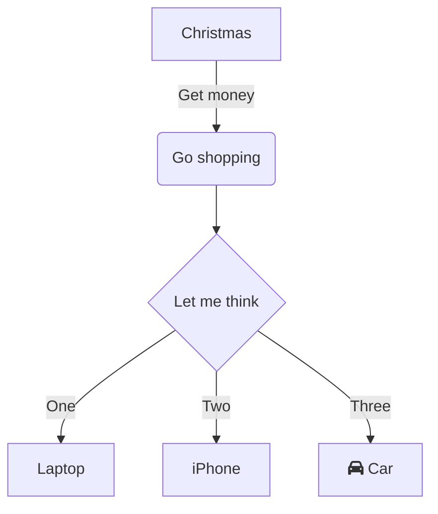
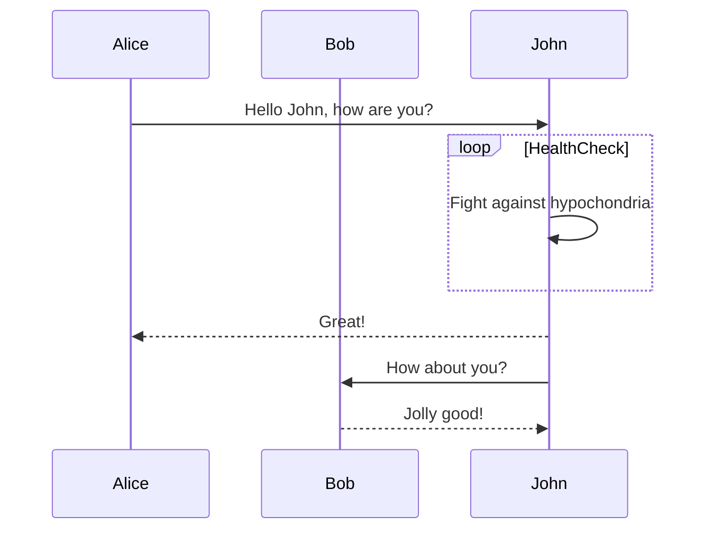
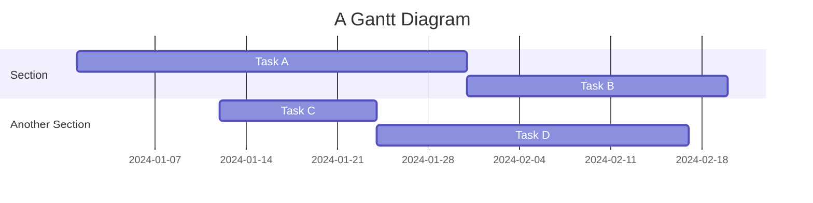
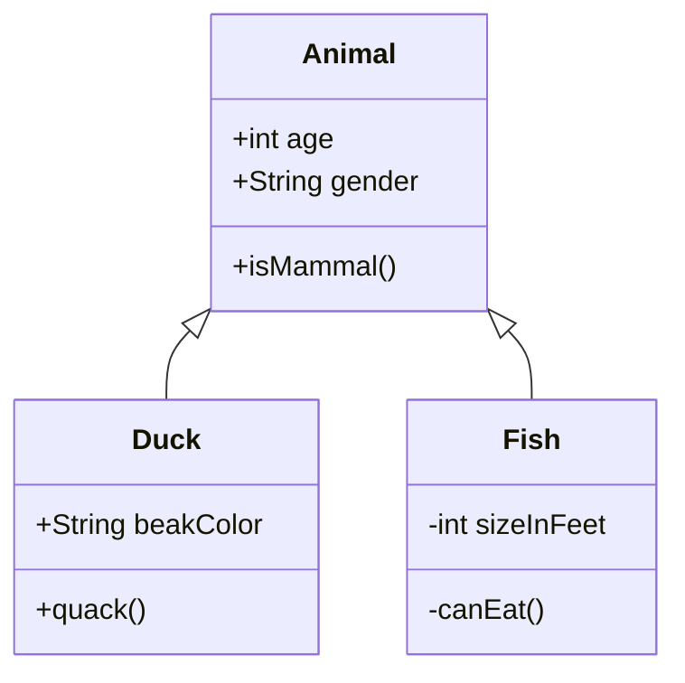

# Markdown Reference

A complete reference for all Markdown syntax supported by **Markdown Viewer**, implementing [CommonMark](https://commonmark.org/) plus [GitHub Flavored Markdown (GFM)](https://github.github.com/gfm/) extensions.

---

## Table of Contents

- [Headings](#headings)
- [Paragraphs & Line Breaks](#paragraphs--line-breaks)
- [Emphasis](#emphasis)
- [Blockquotes](#blockquotes)
- [Lists](#lists)
- [Task Lists](#task-lists)
- [Code](#code)
- [Horizontal Rules](#horizontal-rules)
- [Links](#links)
- [Images](#images)
- [Tables](#tables)
- [Footnotes](#footnotes)
- [HTML](#html)
- [Math (LaTeX)](#math-latex)
- [Mermaid Diagrams](#mermaid-diagrams)
- [Emoji](#emoji)
- [Strikethrough](#strikethrough)
- [Escaping Characters](#escaping-characters)

---

## Headings

```markdown
# Heading 1
## Heading 2
### Heading 3
#### Heading 4
##### Heading 5
###### Heading 6
```

Alternative syntax for H1 and H2:

```markdown
Heading 1
=========

Heading 2
---------
```

---

## Paragraphs & Line Breaks

A blank line separates paragraphs.  
Two trailing spaces or a backslash `\` at the end of a line creates a line break within a paragraph.

```markdown
First paragraph.

Second paragraph.

Line one  
Line two (two trailing spaces before newline)

Line one\
Line two (backslash before newline)
```

---

## Emphasis

| Syntax | Output |
|--------|--------|
| `*italic*` or `_italic_` | *italic* |
| `**bold**` or `__bold__` | **bold** |
| `***bold italic***` | ***bold italic*** |
| `~~strikethrough~~` | ~~strikethrough~~ |

---

## Blockquotes

```markdown
> This is a blockquote.
>
> It can span multiple paragraphs.

> Nested blockquote:
>> Second level
>>> Third level
```

---

## Lists

### Unordered Lists

```markdown
- Item one
- Item two
  - Nested item
  - Another nested item
- Item three
```

You can also use `*` or `+` as list markers.

### Ordered Lists

```markdown
1. First item
2. Second item
   1. Nested ordered item
3. Third item
```

> Numbers do not need to be sequential; they are always rendered in order.

### Loose Lists

Add blank lines between items to create "loose" (paragraph-spaced) lists:

```markdown
- Item one

- Item two

- Item three
```

---

## Task Lists

GitHub Flavored Markdown task lists:

```markdown
- [x] Completed task
- [ ] Incomplete task
- [x] Another completed task
```

Checkboxes are rendered as interactive HTML checkboxes in the preview.

---

## Code

### Inline Code

```markdown
Use `backticks` for inline code.
```

### Fenced Code Blocks

Use triple backticks with an optional language identifier:

````markdown
```javascript
const greet = (name) => `Hello, ${name}!`;
console.log(greet("World"));
```
````

### Indented Code Blocks

Indent 4 spaces to create a code block (no syntax highlighting):

```markdown
    function example() {
        return true;
    }
```

---

## Horizontal Rules

Use three or more hyphens, asterisks, or underscores on a line by themselves:

```markdown
---
***
___
```

---

## Links

### Inline Links

```markdown
[Link text](https://example.com)
[Link with title](https://example.com "Title")
```

### Reference Links

```markdown
[Link text][reference-id]

[reference-id]: https://example.com "Optional Title"
```

### Autolinks

URLs and email addresses surrounded by angle brackets become links:

```markdown
<https://example.com>
<user@example.com>
```

Bare URLs are also automatically linked:

```markdown
https://example.com
```

---

## Images

```markdown


```

Reference-style images:

```markdown
![Alt text][image-ref]

[image-ref]: https://example.com/image.png "Title"
```

---

## Tables

GFM tables use pipe characters and hyphens:

```markdown
| Header 1 | Header 2 | Header 3 |
|----------|:--------:|---------:|
| Left     | Center   | Right    |
| Cell     | Cell     | Cell     |
```

Column alignment is set by the colon position in the separator row:

| Syntax | Alignment |
|--------|-----------|
| `---` | Left (default) |
| `:---:` | Center |
| `---:` | Right |
| `:---` | Left (explicit) |

---

## Footnotes

```markdown
Here is a sentence with a footnote.[^1]

[^1]: This is the footnote content.
```

Multi-paragraph footnotes:

```markdown
[^long]: Footnote paragraph one.

    Footnote paragraph two (indented 4 spaces).
```

---

## HTML

Raw HTML is supported and renders as-is (after DOMPurify sanitization):

```markdown
<div style="color: red;">
  This text is red.
</div>

<details>
  <summary>Click to expand</summary>
  Hidden content here.
</details>
```

> **Note**: Some HTML attributes may be stripped by DOMPurify for security.

---

## Math (LaTeX)

Requires MathJax (enabled by default).

### Inline Math

```markdown
Einstein's equation: $E = mc^2$

The Pythagorean theorem: $a^2 + b^2 = c^2$
```

### Display (Block) Math

```markdown
$$
\sum_{n=1}^{\infty} \frac{1}{n^2} = \frac{\pi^2}{6}
$$
```

### Common LaTeX Commands

| Command | Output |
|---------|--------|
| `\frac{a}{b}` | Fraction |
| `\sqrt{x}` | Square root |
| `x^{n}` | Superscript |
| `x_{n}` | Subscript |
| `\int_a^b` | Integral |
| `\sum_{i=0}^n` | Summation |
| `\alpha, \beta, \gamma` | Greek letters |
| `\mathbf{v}` | Bold vector |
| `\begin{matrix}…\end{matrix}` | Matrix |

---

## Mermaid Diagrams

Wrap Mermaid syntax in a fenced code block with the `mermaid` language identifier.

### Flowchart

````markdown

````

### Sequence Diagram

````markdown

````

### Gantt Chart

````markdown

````

### Class Diagram

````markdown

````

---

## Emoji

Use GitHub-style emoji shortcodes:

```markdown
:smile: :thumbsup: :rocket: :warning: :white_check_mark:
```

Renders as: 😄 👍 🚀 ⚠️ ✅

A full list of supported shortcodes is available at [emoji.joypixels.com](https://emoji.joypixels.com/).

---

## Strikethrough

GFM extension:

```markdown
~~This text is struck through~~
```

---

## Escaping Characters

Use a backslash to escape Markdown special characters:

```markdown
\*Not italic\*
\# Not a heading
\[Not a link\]
\`Not code\`
```

Escapable characters: `\ ` ` * _ { } [ ] ( ) # + - . ! |`
